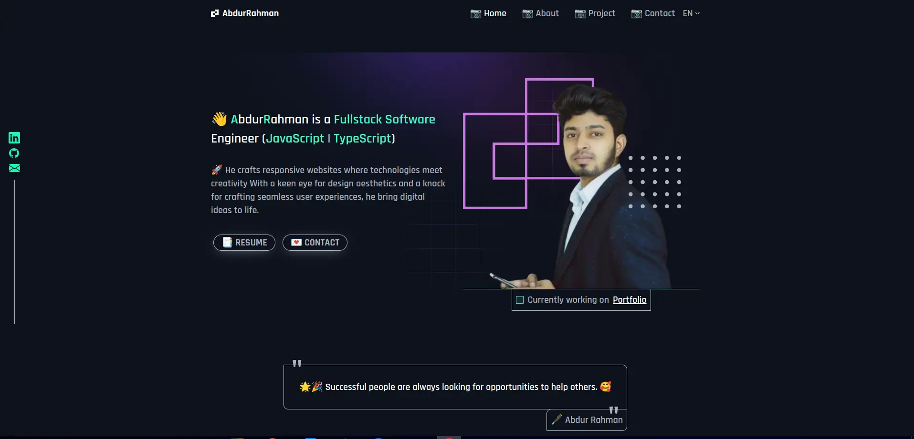

### 👋 AbdurRahman is a Frontend Software Enginner (React | Next | Angular)  

🚀 He crafts responsive websites where technologies meet creativity With a keen eye for design aesthetics and a knack for crafting seamless user experiences, he bring digital ideas to life with Programming, Internet, Framework, Database, Git, API Design, Integration, Cloud.

:coffee: &emsp;Connect with me! and 📫 How to reach me:

       

♥️  I enjoy programming and sharing knowledge with others  
🌱  I’m currently learning FullStack JS|TS Software Engineering  
👯  I’m looking to collaborate on open source projects  
🔭  I’m currently working on a few projects  
💬  Ask me about anything related to Javascript, Typescript  
📚  I love to read books and learn new things  
⚡  Fun fact: I love to travel and explore new places  
📫  How to reach me: mailto: abdurrahmansoftw@gmail.com  

 
More It has always been my passion to learn new things, explore new ideas and thoughts and emphasized on self-development. It has always been my focus on every available opportunity to improve myself skills. I want to pursue my goals with dedication, sincerity, honesty and hard work.

#### Languages

  

#### Front-End Development

     

    

#### Back-End & Databases & Cloud Services & Tools & devOps

       

#### My Projects & Ventures

<table>
  <thead align="center">
    <tr border: none;>
      <td><b>Project Name</b></td>
      <td><b>Description</b></td>
      <td><b> For </b></td>
    </tr>
  </thead>
  <tbody>
   <tr>
      <td><a href="https://financepr.vercel.app" target="_blank">Finance Pro</a></td>
      <td>Finance Pro is a web application that helps you manage your company's Finances</td>
      <td> Client Project </td>
    </tr>
   <tr>
      <td><a href="https://github.com/arswe/attendance-management-system" target="_blank">Attendance Management System</a></td>
      <td>Attendance Management System</td>
      <td> Running Project </td>
    </tr>
     <tr>
      <td><a href="https://employeemanagementsystem.vercel.app" target="_blank">Employee management System</a></td>
      <td>Employee management system is a web application that helps to manage employee information</td>
      <td> Client Project </td>
    </tr>
   <tr>
      <td><a href="https://helpdesk-ecru.vercel.app" target="_blank">Helpdesk</a></td>
      <td>helpdesk is take your issue and summarizes </td>
      <td> Client Project </td>
    </tr>
    <tr>
      <td><a href="https://tsxgames.vercel.app" target="_blank">TSX Games</a></td>
      <td>TSX Games is a video game discovery web app that helps you find new and interesting games to play </td>
      <td> Typoescript Practics Project </td>
    </tr>

   <tr>
      <td><a href="https://chatapp-jx8l.onrender.com/" target="_blank">Chat Application</a></td>
      <td>A university-specific chat application could be a great way to connect students and faculty. It could provide a platform for discussion, collaboration, and communication</td>
      <td>University semester final Porject </td>
    </tr>

  </tbody>
</table>
